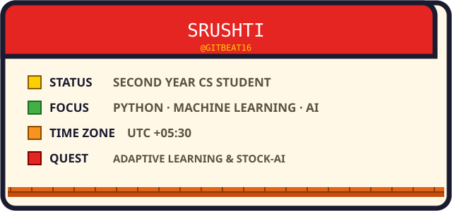

 

&nbsp;&nbsp;
&nbsp;&nbsp;
&nbsp;&nbsp;

 

 

 

I'm just getting started on my coding quest — jumping between Python projects, hackathons, and machine learning experiments, and slowly leveling up as an AI learner. Second year Computer Science student, always looking for the next pipe to explore.

 

 

&nbsp;&nbsp;
&nbsp;&nbsp;
&nbsp;&nbsp;
&nbsp;&nbsp;
&nbsp;&nbsp;

 

 

NeetCode doesn't currently offer a public profile API, so a live stats badge for it isn't possible yet — happy to add one the moment they support it.

 

 

 

 

  

  

THANKS FOR VISITING. THE PRINCESS IS IN ANOTHER REPO.

