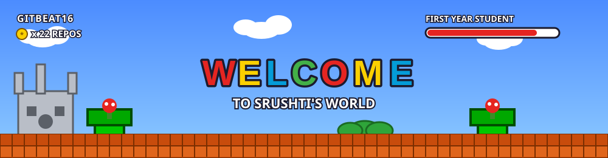
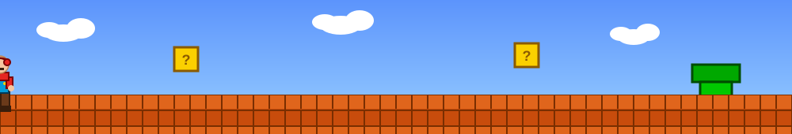

 

[ABOUT](#about) &nbsp;•&nbsp; [SKILLS](#skills) &nbsp;•&nbsp; [PROJECTS](#projects) &nbsp;•&nbsp; [STATS](#stats) &nbsp;•&nbsp; [CONNECT](#connect)

 

 

<h2 id="about">ABOUT ME</h2>

I'm just getting started on my coding quest, jumping between Python projects, hackathons, and the occasional bug that acts like a Goomba blocking the path. First year student, always looking for the next pipe to explore.

| | |
|---|---|
| **Name** | Srushti (GitBeat16) |
| **Status** | First Year Student |
| **Timezone** | UTC +05:30 |
| **LinkedIn** | [srushti-kalokhe-95a887385](https://www.linkedin.com/in/srushti-kalokhe-95a887385/) |

 

<h2 id="skills">SKILLS</h2>

 

<h2 id="projects">FEATURED PROJECTS</h2>

 

 

<h2 id="stats">SCORE BOARD</h2>

 

<h3 align="center">CONTRIBUTION MAP</h3>

 

 

<h2 id="connect" align="center">CONNECT</h2>

  

THANKS FOR VISITING. THE PRINCESS IS IN ANOTHER REPO.

