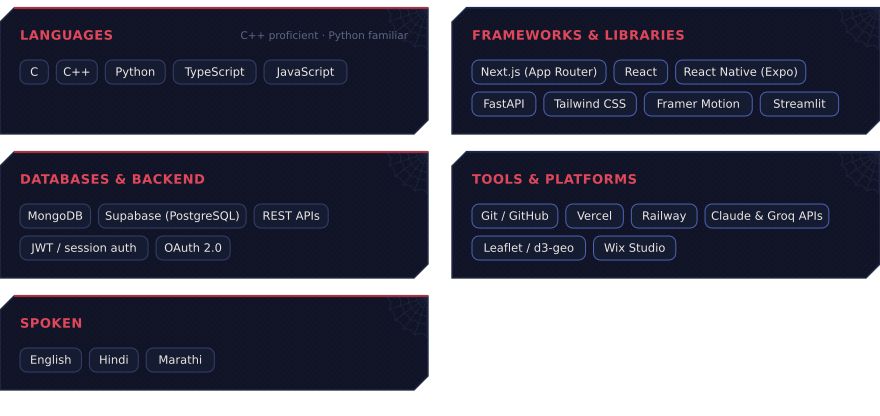
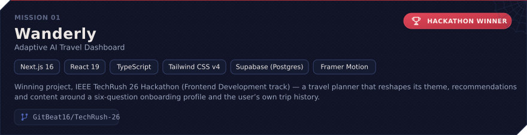
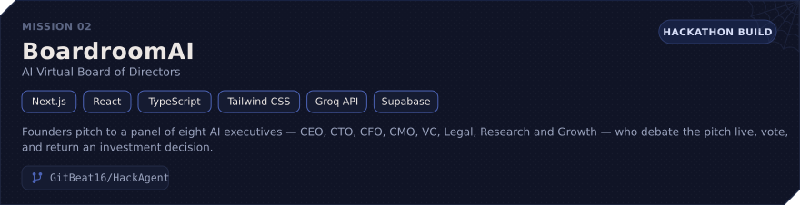
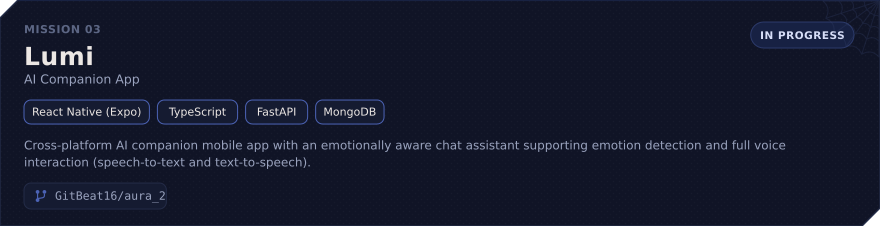
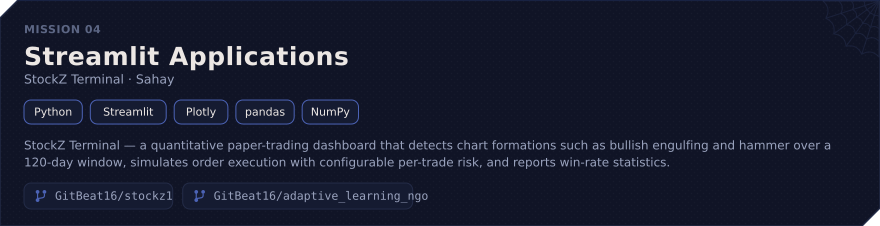
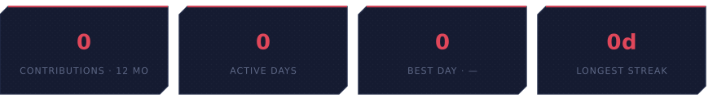
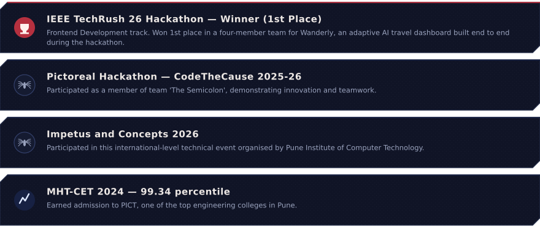

Second-year Computer Engineering student @ PICT Pune 
I build full-stack products with TypeScript, Next.js, React Native, and FastAPI.
Interested in AI/ML, open source, system design, and developer tooling — with a particular curiosity for how things work beneath the abstraction.
I learn by building, breaking, understanding, and rebuilding.
Currently turning ideas into software >.<

| | |
| --- | --- |
| **Degree** | Computer Engineering — Pune Institute of Computer Technology (SPPU) |
| **Year** | Second Year (SE), Semester III |
| **Marks** | CGPA 9.44 · SGPA 9.54 / 9.29 · MHT-CET 99.34 %ile · SSC 96.40% · HSC 76.17% |
| **Based in** | Pune, Maharashtra |

  
  

 

<b>MISSION 01 — Wanderly</b> · adaptive AI travel dashboard · <i>IEEE TechRush 26 winner</i> · <a href="https://github.com/GitBeat16/TechRush-26">repo</a>

`Next.js 16` `React 19` `TypeScript` `Tailwind CSS v4` `Supabase (Postgres)` `Framer Motion`

- Winning project, IEEE TechRush 26 Hackathon (Frontend Development track) — a travel planner that
  reshapes its theme, recommendations and content around a six-question onboarding profile and the
  user's own trip history.
- Explainable personalisation engine that scores destinations against stated preferences and past
  travel, surfacing the reason behind every recommendation.
- Deterministic, weather-driven packing rules over the Open-Meteo forecast and historical archive,
  plus a budget planner with per-destination feasibility floors that refuses infeasible optimisations.
- Server-side auth built from scratch: scrypt hashing, HMAC-SHA256 httpOnly session cookies, Google
  OAuth 2.0 with PKCE, and an offline-first store mirrored to localStorage with debounced background
  sync to Supabase.
- Entire UI hand-built with no component library, including a canvas-rendered d3-geo globe, an SVG
  icon set and procedurally synthesised WebAudio sounds.

<b>MISSION 02 — BoardroomAI</b> · AI virtual board of directors · <a href="https://github.com/GitBeat16/HackAgent">repo</a>

`Next.js` `React` `TypeScript` `Tailwind CSS` `Groq API` `Supabase`

- Founders pitch to a panel of eight AI executives — CEO, CTO, CFO, CMO, VC, Legal, Research and
  Growth — who debate the pitch live, vote, and return an investment decision.
- Each session generates the full pack: SWOT, market research, financial model, risk matrix, pitch
  deck, roadmap, PRD and an executive report.
- Dashboard analytics with score trends, health scores, radar charts, recent meetings and an activity
  feed; Groq drives the debate and document generation, Supabase handles auth and persistence.

<b>MISSION 03 — Lumi</b> · AI companion app · <i>in progress</i> · <a href="https://github.com/GitBeat16/aura_2">repo</a>

`React Native (Expo)` `TypeScript` `FastAPI` `MongoDB`

- Cross-platform AI companion mobile app with an emotionally aware chat assistant supporting emotion
  detection and full voice interaction (speech-to-text and text-to-speech).
- FastAPI + MongoDB backend with JWT authentication, mood tracking and check-ins, mood-based daily
  action suggestions, and Spotify integration for music.
- Mobile frontend in React Native (Expo) and TypeScript using Expo Router, animations and secure
  on-device token storage.

<b>MISSION 04 — Streamlit applications</b> · StockZ Terminal · Sahay

`Python` `Streamlit` `Plotly` `pandas` `NumPy`

- **[StockZ Terminal](https://github.com/GitBeat16/stockz1)** — a quantitative paper-trading
  dashboard that detects chart formations such as bullish engulfing and hammer over a 120-day window,
  simulates order execution with configurable per-trade risk, and reports win-rate statistics.
- **[Sahay](https://github.com/GitBeat16/adaptive_learning_ngo)** — an adaptive peer-learning
  matchmaker that pairs mentors and mentees on complementary academic strengths, with session chat,
  file sharing, credits, badges and a mentor leaderboard.

> The calendar above is **not** GitHub's built-in graph — that one can't be restyled or animated from
> a README. It's a custom SVG rendered from real calendar data by
> [`scripts/sync-contributions.mjs`](scripts/sync-contributions.mjs), and a
> [scheduled workflow](.github/workflows/sync-contributions.yml) refreshes it every day.

  
  
  

<!--
  ─────────────────────────────────────────────────────────────────────────
  This profile is generated. Nothing above is hand-edited HTML soup.

    npm run dev     live Next.js prototype (mascot, motion, contribution web)
    npm run sync    pull real contribution data + re-export every SVG
    npm run assets  re-export the SVGs only

  Content lives in data/profile.ts, the drawing lives in shared/mascot.mjs,
  the exporters live in scripts/. See CONTRIBUTING-ASSETS.md.

  Clickable controls (repo buttons, contact buttons) have to be Markdown
  anchors wrapping a badge image: GitHub embeds SVGs through , so a
  link *inside* an SVG is inert.
  ─────────────────────────────────────────────────────────────────────────
-->
