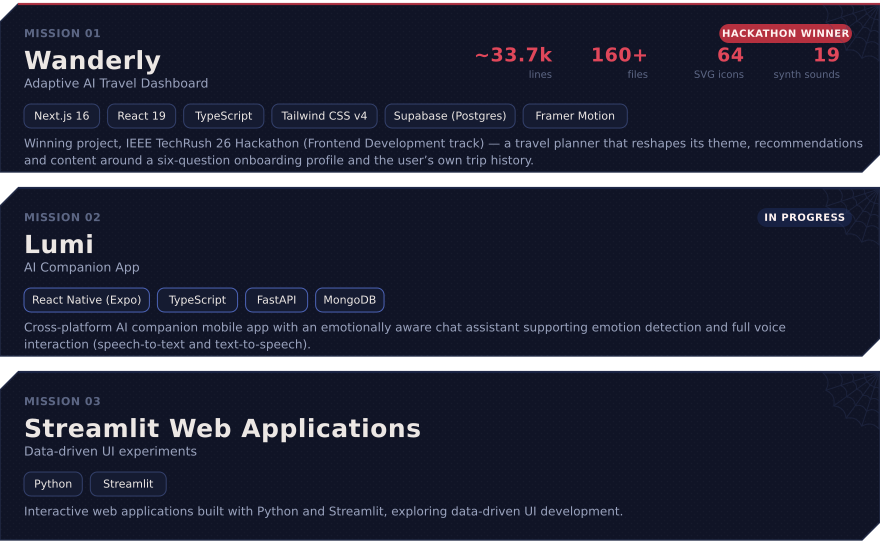

  

Second-year Computer Engineering student at **PICT Pune** (CGPA **9.41**), working mostly in
TypeScript across **Next.js**, **React Native** and **FastAPI**.

Most of what I build is full-stack and *finished* rather than prototyped — **Wanderly** shipped with
hand-rolled auth (scrypt + HMAC session cookies + Google OAuth/PKCE), an offline-first store and a
canvas-rendered globe, and won the **IEEE TechRush 26** frontend track. Right now I'm building
**Lumi**, a React Native + FastAPI AI companion app with emotion detection and voice interaction.

| | |
| --- | --- |
| **Degree** | B.E. Computer Engineering — Pune Institute of Computer Technology (SPPU) |
| **Year** | Second Year (SE), Semester I |
| **Marks** | CGPA (FY) 9.41 · SGPA 9.54 / 9.29 · MHT-CET 99.34 %ile · SSC 96.40% · HSC 76.17% |
| **Based in** | Pune, Maharashtra |

<b>MISSION 01 — Wanderly</b> · adaptive AI travel dashboard · <i>IEEE TechRush 26 winner</i>

`Next.js 16` `React 19` `TypeScript` `Tailwind CSS v4` `Supabase (Postgres)` `Framer Motion`

- Winning project, IEEE TechRush 26 Hackathon (Frontend Development track) — a travel planner that
  reshapes its theme, recommendations and content around a six-question onboarding profile and the
  user's own trip history.
- Explainable personalisation engine that scores destinations against stated preferences and past
  travel, surfacing the reason behind every recommendation.
- Deterministic, weather-driven packing rules over the Open-Meteo forecast and historical archive,
  plus a budget planner with per-destination feasibility floors that refuses infeasible optimisations.
- Server-side auth built from scratch: scrypt hashing, HMAC-SHA256 httpOnly session cookies, Google
  OAuth 2.0 with PKCE, and an offline-first store mirrored to localStorage with debounced background
  sync to Supabase.
- Entire UI hand-built with no component library — ~33,700 lines across 160+ files, including a
  canvas-rendered d3-geo globe, 64 SVG icons and 19 procedurally synthesised WebAudio sounds.

<b>MISSION 02 — Lumi</b> · AI companion app · <i>in progress</i>

`React Native (Expo)` `TypeScript` `FastAPI` `MongoDB`

- Cross-platform AI companion mobile app with an emotionally aware chat assistant supporting emotion
  detection and full voice interaction (speech-to-text and text-to-speech).
- FastAPI + MongoDB backend with JWT authentication, mood tracking and check-ins, mood-based daily
  action suggestions, and Spotify integration for music.
- Mobile frontend in React Native (Expo) and TypeScript using Expo Router, animations and secure
  on-device token storage.

<b>MISSION 03 — Streamlit web applications</b> · data-driven UI experiments

`Python` `Streamlit`

- Interactive web applications built with Python and Streamlit, exploring data-driven UI development.

> The calendar above is **not** GitHub's built-in graph — that one can't be restyled or animated from
> a README. It's a custom SVG rendered from real calendar data by
> [`scripts/sync-contributions.mjs`](scripts/sync-contributions.mjs), and a
> [scheduled workflow](.github/workflows/sync-contributions.yml) refreshes it every day.

  <a href="mailto:srushtipict@gmail.com"><b>srushtipict@gmail.com</b></a> ·
  <a href="https://github.com/GitBeat16"><b>GitHub</b></a> ·
  <a href="https://linkedin.com/in/srushti-kalokhe-95a887385"><b>LinkedIn</b></a>

<!--
  ─────────────────────────────────────────────────────────────────────────
  This profile is generated. Nothing above is hand-edited HTML soup.

    npm run dev     live Next.js prototype (mascot, motion, contribution web)
    npm run sync    pull real contribution data + re-export every SVG
    npm run assets  re-export the SVGs only

  Content lives in data/profile.ts, the drawing lives in shared/mascot.mjs,
  the exporters live in scripts/. See CONTRIBUTING-ASSETS.md.
  ─────────────────────────────────────────────────────────────────────────
-->
